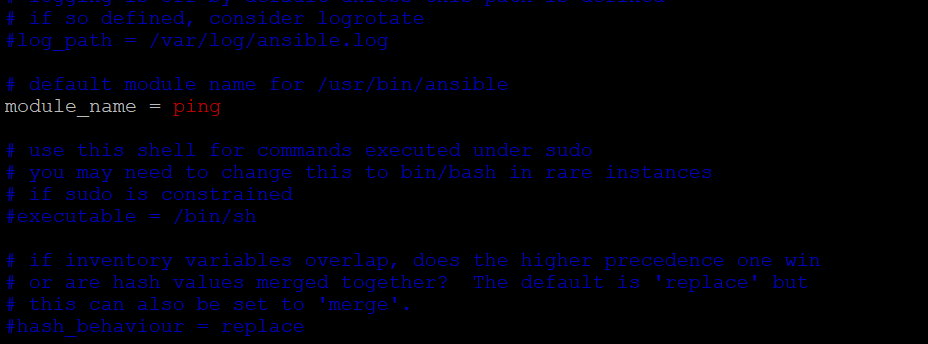

# Hi, I'm Deepak! 👋

### Topics to be Covered:
    Installing Ansible using pip, yum or apt
    Automating Ansible Installation
    Configuration file basics

What You Will Learn:
How easy it is to install and configure Ansible for yourself.

## Assignment:

### Create a utility to install ansible   
- By Default it should install latest version
- but user can give other version as well
- Make sure that all validations are in place. i.e if version mismatch then upgrade should happend if already install then error will be shown.

### Create separate inventory file for each ninja groups (rrr,avengers)
- By default if I run ping command then my controls server should ping servers of my ninja group.

## Also I should be able to ping a specicic ninja group users servers.

### We have achieved this by doing changes in ansible.cfg file.

## Do further modification where I can only ping my ninja group servers sequentially, wehreas other  ninja group servers can be pinged simultaneously.

## we have achieved this task by changing fork value to 1 so that my ninja groups are pinged sequentially one by one.

## If I run ansible as command, PING module should get called. $ ansible

### We have achieved this again by changing ansible.cfg file.

- Analyse atleast 2 parameters in config file
