# Hi, I'm Deepak! .👋

## Module Practice:

## Create a users using Ansible.
## Make sure you should have option to assign differnet shell to them

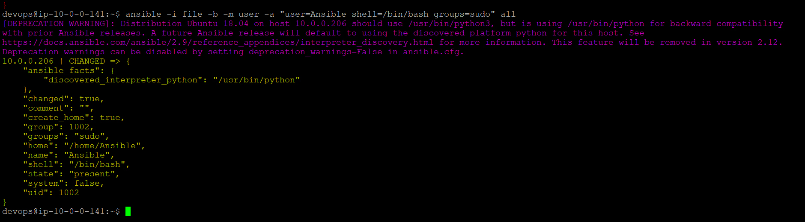

## Fetch All import system info of the nodes using Ansible.
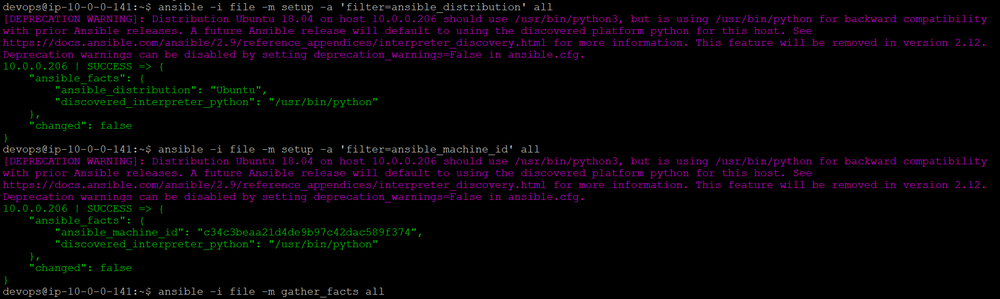
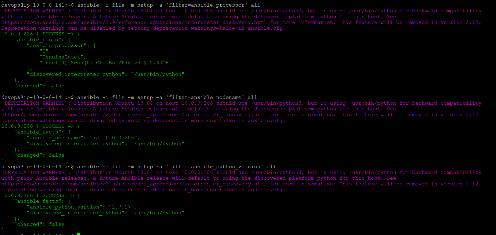
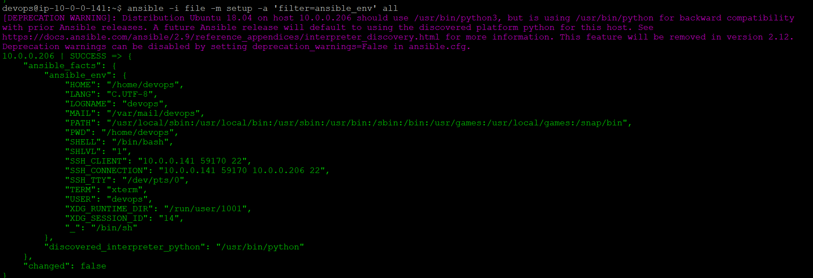

## Setup LAMP using Ansible modules/Adhoc commands.

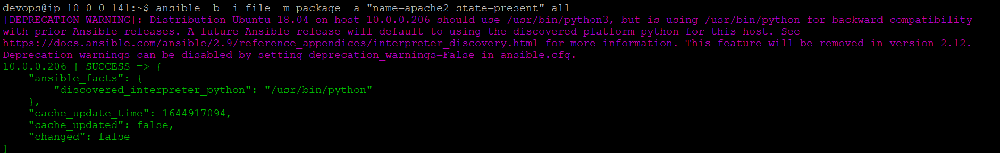
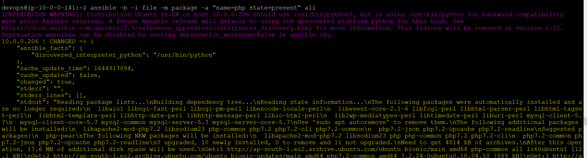
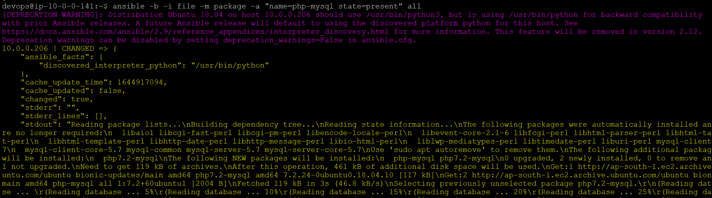
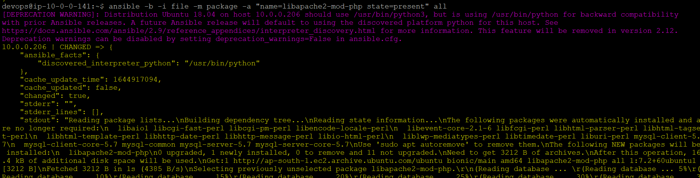
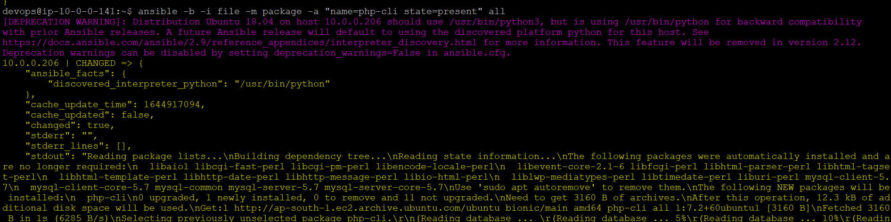
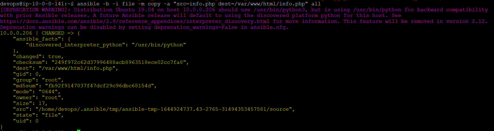
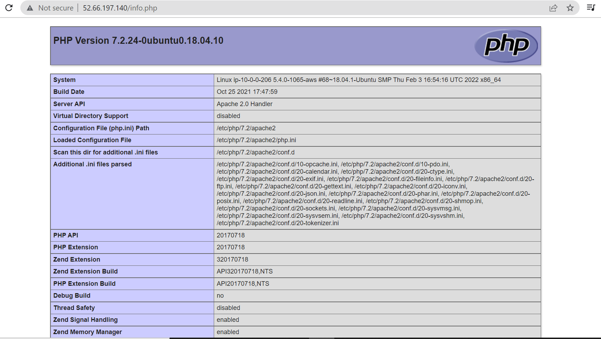
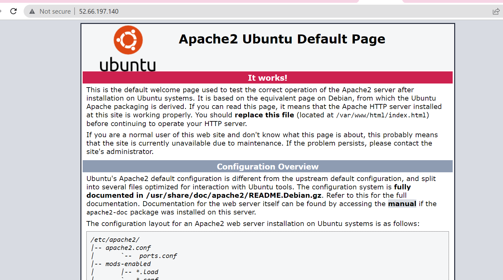

## Good To DO:
Setup everything using Jenkins as well and all above modules should come as an dropdown and on the basis of other values as well.

